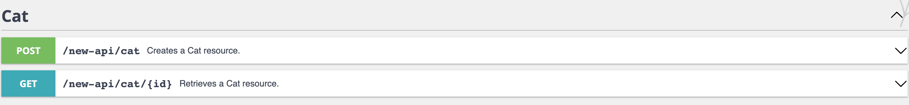

API Module Example
=====================

## About

This example module demonstrates how to modify PrestaShop's new API.

## Install

1. Copy the `apiexample` directory into PrestaShop's `modules` directory.
2. `composer install` in the module's directory. (`[...]/modules/apiexample`)
3. `bin/console prestashop:module install apiexample` in PrestaShop's directory.

## License

This module is released under the [Academic Free License 3.0][AFL-3.0] 

[report-issue]: https://github.com/PrestaShop/PrestaShop/issues/new/choose
[AFL-3.0]: https://opensource.org/licenses/AFL-3.0
